# LoadBalancer-Core

用 .Net 6 做簡單版的負載平衡器。

詳細說明請見 Blog:

https://felicnoblog.blogspot.com/2023/02/day-1.html
https://felicnoblog.blogspot.com/2023/02/day-2.html
https://felicnoblog.blogspot.com/2023/03/day-3.html
https://felicnoblog.blogspot.com/2023/03/day-4.html
https://felicnoblog.blogspot.com/2023/03/day-5.html

```mermaid
graph TB
A((Client)) -- 進入 --> E
subgraph Load Balance
B[初始化HttpClient] --> G
B --> E[程式判斷要連線的站台]
G[Timer-Health Check]
end 
subgraph site1
E -- 分流 --> C[Web]
G -- StatusCode 200? --> H[site1/healthcheck]
end 
subgraph site2
E -- 分流 --> D[Web]
G -- StatusCode 200? --> I[site2/healthcheck]
end 
C --> H
D --> I
G -- 紀錄檢查結果 --> E
```

